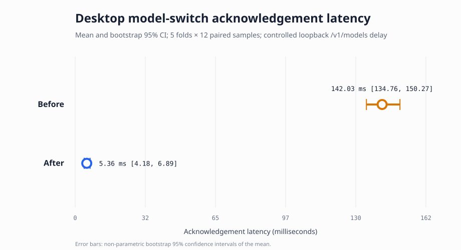

# Desktop model-switch acknowledgement benchmark

Date: 20 August 2026

## Question

Does reusing a fresh, server-owned catalogue proof already returned to the Desktop model picker reduce the acknowledgement time for a live model switch without permitting a client-asserted fast path?

## Design

This is a five-fold paired repeated-measures benchmark of the production `hermes_cli.model_switch.switch_model` path. Each fold contains twelve matched before-and-after observations, giving 60 pairs in total. A seeded loopback OpenAI-compatible `/v1/models` endpoint introduces 35–95 ms of delay per request. The before condition performs the redundant live catalogue request; the after condition supplies the exact provider/model pair previously served by `model.options` and therefore omits only that repeated request.

The benchmark keeps credential resolution, provider normalisation, routing, expensive-model confirmation, API-mode resolution, and client construction in the measured production path. Only models.dev enrichment is patched to its cache-only result so that the experiment isolates the catalogue round trip under study. Three warm-up calls precede each condition. The raw observations and the benchmark script are committed alongside this report.

The word fold describes repeated paired measurement groups rather than predictive-model training. No statistical model is fitted, so this is cross-validated performance measurement, not machine-learning generalisation assessment.

## Results

| Statistic | Before | After |
| --- | ---: | ---: |
| Observations | 60 | 60 |
| Mean | 142.028 ms | 5.361 ms |
| Standard deviation | 30.975 ms | 5.435 ms |
| Median | 138.708 ms | 3.642 ms |
| 95th percentile | 191.892 ms | 15.504 ms |
| Minimum | 93.969 ms | 2.768 ms |
| Maximum | 293.873 ms | 34.917 ms |
| Bootstrap 95% CI for the mean | [134.764, 150.272] ms | [4.182, 6.888] ms |
| `/v1/models` requests | 60 | 0 |

The paired mean reduction was 136.667 ms, with a bootstrap 95% confidence interval of [129.077, 145.143] ms. Mean acknowledgement latency fell by 96.225%, or 26.492 times. Every one of the 60 paired differences favoured the after condition. An exact two-sided paired sign test gives `p = 1.734723475976807e-18`.

| Fold | Before mean | After mean |
| ---: | ---: | ---: |
| 1 | 142.576 ms | 8.065 ms |
| 2 | 160.908 ms | 4.791 ms |
| 3 | 135.607 ms | 5.059 ms |
| 4 | 130.770 ms | 3.261 ms |
| 5 | 140.281 ms | 5.630 ms |



## Interpretation

The result supports removing the second catalogue lookup when, and only when, the gateway can prove that it recently served the exact provider/model pair to this session's picker. The proof expires after five minutes and cannot be supplied by the client. Unproven and expired model switches continue through the existing live validation path, and the regression tests cover both branches.

The absolute saving on a real network depends on provider distance and catalogue response time. The controlled endpoint deliberately favours reproducibility over claims about any particular public provider. The direction of the effect is nevertheless direct: the amended path removes one network request and no other validation or construction stage.

## Reproduction

Run the conditions from the repository root with the same interpreter:

```powershell
python scripts/benchmark_desktop_model_switch.py measure --condition before --output before.csv
python scripts/benchmark_desktop_model_switch.py measure --condition after --output after.csv
python scripts/benchmark_desktop_model_switch.py analyse --before before.csv --after after.csv --output-dir results
```

The analysis command validates the paired fold/sample keys and scheduled delays before calculating summaries, bootstrap confidence intervals, the exact sign test, and the SVG error-bar chart.
